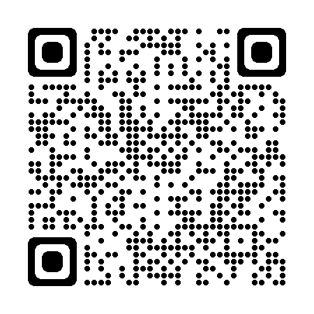
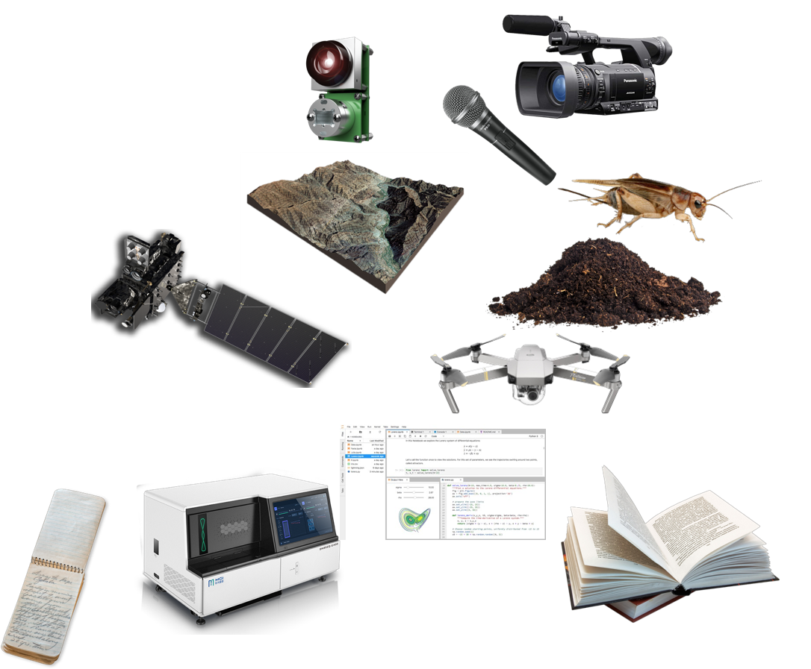
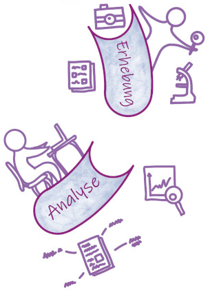
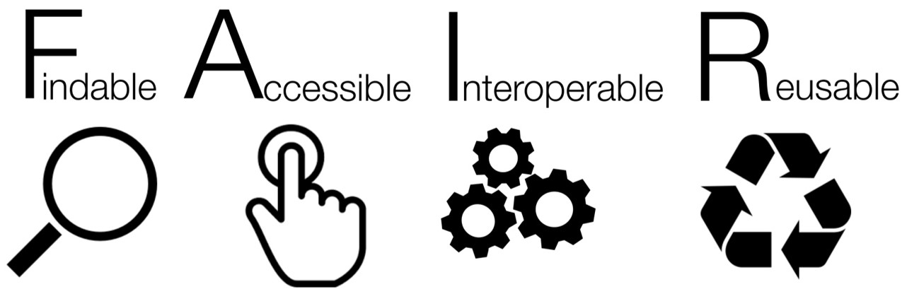
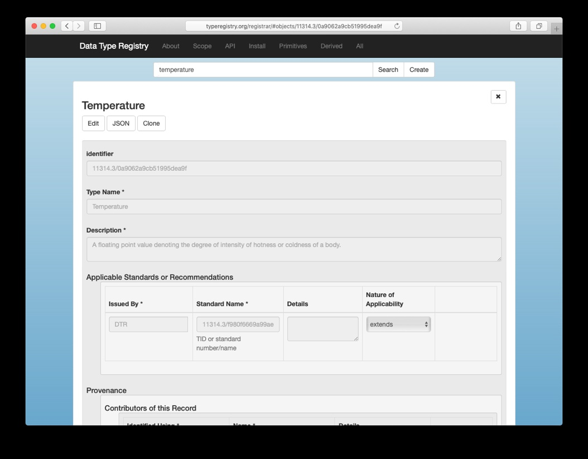
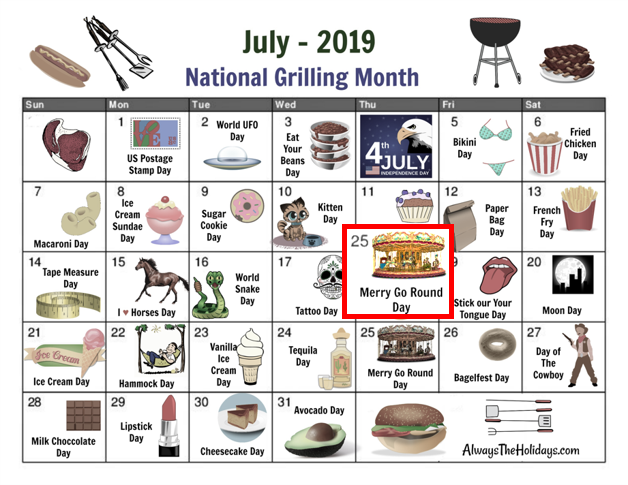
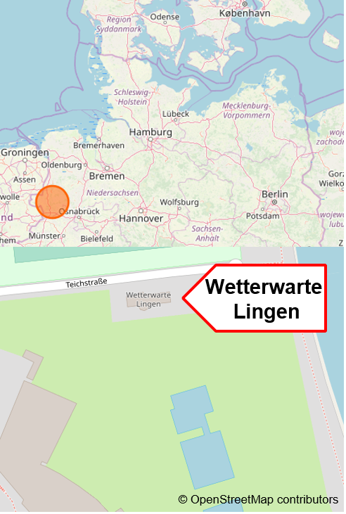
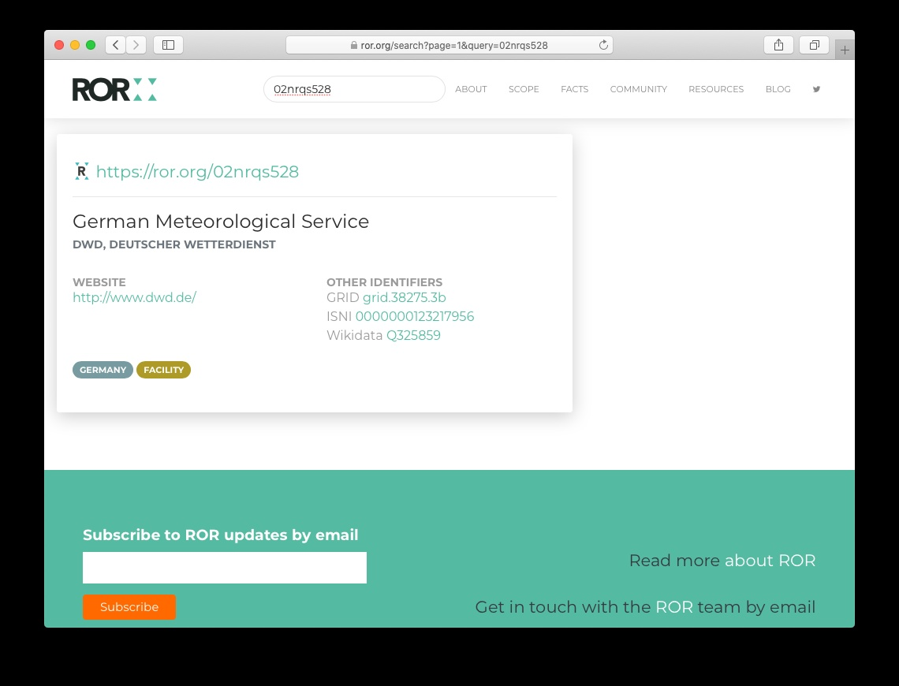
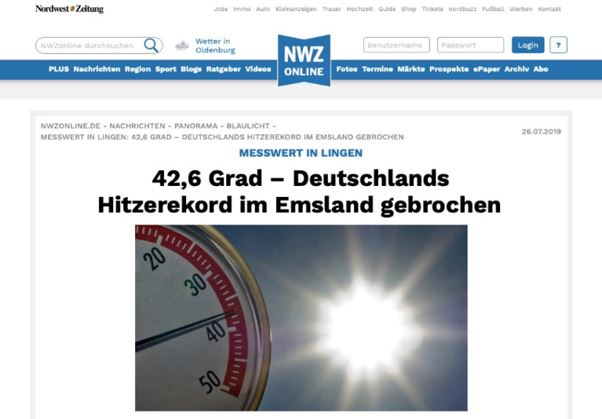
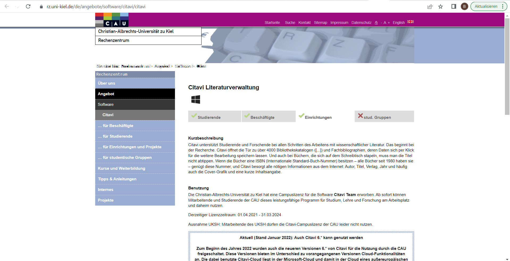

<!--
author:   Britta Petersen
email:    b.petersen@rz.uni-kiel.de
version:  1.0
language: de
narrator: deutsch female
title: Kurze Einführung in das Forschungsdatenmanagement

comment: Begleitende Seminarsitzung im Rahmen der Veranstaltung [Projektseminar zur Geschichte der Neuzeit: Frauengeschichte(n) in der Frühen Neuzeit digital erschließen.](http://www.univis.uni-kiel.de/form?__s=2&dsc=anew/lecture_view&lvs=philos/histor/zentr/projek_3&anonymous=1&founds=philos/histor/zentr/aufbau_0,/projek_1,/projek_3&nosearch=1&ref=main&sem=2024s&__e=864) (Sommersemester 2024)

licence: cc-by

logo: https://github.com/RDM4CAU/Demos/raw/main/Frauenvortragsmarathon2024/images/cau-norm-en-lilagrey-rgb.png

@style

.lia-slide__container {
    background-image: url("https://github.com/RDM4CAU/Demos/raw/main/Frauenvortragsmarathon2024/images/cau-norm-en-lilagrey-rgb.png");
    background-size: 15%;
    background-repeat: no-repeat;
    background-position: right top;
    opacity: 1;
}

@end

-->

# Forschungsdatenmanagement

> <big>**Kurze Einführung in das Forschungsdatenmanagement (FDM)**</big><br> 
>
>im Rahmen der Veranstaltung<br> 
>** Projektseminar zur Geschichte der Neuzeit: Frauengeschichte(n) in der Frühen Neuzeit digital erschließen.**<br>
>
>***Sommersemester 2024***
>
> ***Britta Petersen***, [Zentrales Forschungsdatenmanagement](https://www.datamanagement.uni-kiel.de/de)
>
> TinyURL zu diesem Dokument: 

<div style="page-break-after: always;"></div>

## Forschungsdaten? 🧪

{{0-1}}
********************************************************************************

Was sind Forschungsdaten? Welche Beispiele für Forschungsdaten können Sie nennen?
---
**Lassen Sie uns kurz gemeinsam sammeln!**

 <!-- width="250px" align="left" -->

https://answergarden.ch/4120232

********************************************************************************

{{1-2}}
********************************************************************************
<iframe src="https://answergarden.ch/4120232" style="border:0px;width:100%;height:500px" allowfullscreen="true" webkitallowfullscreen="true" mozallowfullscreen="true"></iframe>

********************************************************************************

{{2}}
********************************************************************************
Die DFG schreibt hierzu:

> „Zu Forschungsdaten zählen u. a. Messdaten, Laborwerte, audiovisuelle Informationen, Texte, Surveydaten oder Beobachtungsdaten, methodische Testverfahren sowie Fragebögen. Korpora und Simulationen können ebenfalls zentrale Ergebnisse wissenschaftlicher Forschung darstellen und werden daher ebenfalls unter den Begriff Forschungsdaten gefasst. Da Forschungsdaten in einigen Fachbereichen auf der Analyse von Objekten basieren (z. B. Gewebe-, Material-, Gesteins-, Wasser- und Bodenproben, Prüfkörper, Installationen, Artefakte und Kunstgegenstände), muss der Umgang mit diesen ebenso sorgfältig sein und eine fachlich adäquate Nachnutzungsmöglichkeit, wann immer sinnvoll und möglich, mitgedacht werden. Ähnliches gilt, wenn Software für die Entstehung oder Verarbeitung von Forschungsdaten erforderlich ist.“
>
> (**DFG 2021**)

********************************************************************************

{{3}}
********************************************************************************

Etwas weniger kompliziert definierte das PrePARe Projekt der Camebridge University den Begriff Forschungsadaten:

> “Any any information you use in your research.”
>
> (**University of Camebridge PrePARe Project**)

********************************************************************************

### Beispiele für Forschungsdaten

Alle Informationen, die für die wissenschaftliche Arbeit herangezogen werden, sind mit dem Begriff Forschungsdaten gemeint!

 <!-- width="350px" align="right" -->

- Audio- und Videoaufzeichnungen
- Tagebücher
- Daten aus geografischen Informationssystemen (GIS)
- Labor- und Feldnotizen
- Modell-, Skript- und Forschungssoftwarecode
- Bilder und Abbildungen
- Fragebögen und Codebücher
- Proben und Artefakte
- Sensor-Daten
- Sequenzierdaten
- Spektren
- Text- und Tabellenkalkulationsdokumente
- Textkorpora und Annotationen
- Topographie-Daten
- Abschriften

## Forschungsdatenmanagement? 🗂️->💾

> Forschungsdatenmanagement (FDM) umfasst die Prozesse der **Transformation**, **Selektion** und **Speicherung** von Forschungsdaten mit dem gemeinsamen **Ziel**, diese *langfristig* und *personenunabhängig* **zugänglich**, **nachnutzbar** und **nachprüfbar** zu halten.
>
>(**forschungsdaten.info**)

## (Digitale) Geschichtswissenschaften und FDM 🔗
>**Warum stehe ich hier und "verbrauche" eine Ihrer Seminarsitzungen mit dem Thema Forschungsdatenmanagement?**

>***Was denken Sie?*** 
>
>***An welchen Stellen würden Sie Verbindungen und Bezüge zwischen Ihrer wissenschaftlichen Tätigkeit in diesem Seminar und dem Themenbereich Forschungsdatenmanagement vermuten?***

{{1}}
***********************
**(Digitale) Geschichtswissenschaften**:

- Historische Dokumente (Texte, Bilder, Gegenstände) sind eine äusserst bedeutende **Quelle für Forschungsdaten** in den Geisteswissenschaften.
- Die digitalen Geschichtswissenschaften umfassen z. B. Techniken zur **Automatischen und Semi-automatischen Texterkennung** und zur **Annotation von Digitalisaten**.
- Annotationen können die **Basis für automatisierte Verarbeitungsprozesse** bilden. 
- Annotationen können als **Verlinkungen** zwischen digitalen Inhalten fungieren.  

➡️ Qualität und Integrität sowie die formale wie technische Zugänglichkeit von sowohl physischen Objekten wie entsprechenden Digitalisaten sind für die Analyse- und Visualisierungsprozesse von hoher Bedeutung!

***********************

{{2}}
***********************
**Forschungsdatenmanagement**:

- FDM beschäftigt sich mit Fragen zur **Organisation**, **Erhebnung**, **Dokumentation**, **Speicherung**, **Sicherung** und den **Zugriff** auf Forschungsdaten.
- FDM hat zum **Ziel**, dass Daten **korrekt** und **nachvollziehbar** sind, um die **Reproduzierbarkeit** von Forschungsergebnissen zu gewährleisten.
- FDM befasst sich auch mit Fragen zum Datenschutz und Datenzugriffsrichtlinien, Standardisierungen (z. B. von Metadaten), der langfristigen Archivierung und ethischen Fragestellungen im Umgang mit Forschungsdaten.

➡️ Gutes FDM trägt entscheidend zu Qualität, Integrität und Nachvollziehbarkeit von Forschungsdaten sowie zu formaler und technischer Zugänglichkeit bei.

***********************

# Forschungsdatenlebenszyklus 🔄

{{0-1}}
********************************************************************************
Forschungsdaten werden erhoben, analysiert, visuallisiert, publiziert, archiviert und widerverwertet/nachgenutzt. 

Denken Sie in allen Phasen Ihrer wissenschaftlichen Tätigkeit daran, sorgsam und planvoll mit Ihren Daten umzugehen!

Überlegen Sie immer auch, welche Voraussetzungen für das Arbeiten in den folgenden Phasen der Arbeit nötig sind. 

 <!-- width="550px" align="center" -->
********************************************************************************

{{1-2}}
********************************************************************************
 <!-- width="250px" align="right" -->

**Planung**:

- Werden Daten wiederverwendet? 

  - Wie liegen diese vor? 
  - Welche Nutzungsbedingungen oder Zugriffsregeln liegen vor?

- Auf welche Weise entstehen neue Daten?

  - Welche Geräte und/oder Software müssen eingeplant werden?

- Welche Datentypen, im Sinne von Datenformaten (z. B. Bilddaten, Textdaten oder Messdaten in Tabellen) entstehen?
- Welche Analysen sind geplant? Welche Software ist hierfür nötig?
- Welches Datenvolumen ist zu erwarten?
- Welche Speichermöglichkeiten kommen in Betracht?
- Welche rechtlichen und ethischen Aspekte müssen berücksichtigt werden?
- Wer ist wofür verantwortlich?

********************************************************************************

{{2-3}}
********************************************************************************
 <!-- width="250px" align="right" -->

**Erhebung und Analyse**:

- Welche digitalen Methoden und Werkzeuge (Software) werden zur Erhebung und zur Analyse der Daten genutzt?
- Auf welche Weise werden die Daten gespeichert und gesichert?
- Wie wird die Sicherheit sensibler Daten gewährleistet (Zugriffs- und Nutzungsverwaltung)?
- Welche Ansätze werden verfolgt, um Daten nachvollziehbar zu dokumentieren?
- Welche Maßnahmen werden getroffen, um eine hohe Qualität der Daten zu gewährleisten?

********************************************************************************

{{3-4}}
********************************************************************************

 <!-- width="250px" align="right" -->

**Archivierung & Veröffentlichung**:

- Welche Aufbewahrungspflichten bestehen?
- Existieren wichtige wissenschaftliche Kodizes bzw. fachliche Normen, die Berücksichtigung finden sollten?
- Bestehen rechtliche Besonderheiten in Bezug auf die Daten?
- Sind Auswirkungen oder Einschränkungen in Bezug auf die Veröffentlichung bzw. Zugänglichkeit zu erwarten?
- Auf welche Weise werden nutzungs- und urheberrechtliche Aspekte sowie Eigentumsfragen berücksichtigt?
- Welches ist eine geeignete Infrastruktur für eine Veröffentlichung/die Langzeitarchivierung?
- Welche formalen Vorgaben (z. B. Dateiformate, Metadaten) müssen Datensätze erfüllen?

********************************************************************************

{{4-5}}
********************************************************************************

 <!-- width="250px" align="right" -->

**Nachnutzung**:

- Welche Daten bieten sich für eine Nachnutzung besonders an?
- Nach welchen Kritierien werden Daten für die Nachnutzung ausgewählt?
- In welcher Form (z. B. Formate) werden Daten bereitgestellt?
- Ist die Kontextualisierung/Datendokumentation für die Nachnutzung ausreichend?
- Unter welchen rechtlichen Bedingungen werden Daten für die Nachnutzung bereitgestellt?
- Gibt es Sperrfristen? Falls ja, wann sind die Forschungsdaten für Dritte nutzbar?

********************************************************************************

# Ziel: FAIRe Daten 🎯

Daten langfristig und personenunabhängig zugänglich, nachnutzbar und nachprüfbar halten.
---

{{0-1}}
********************************************************************************
.") <!-- width="550px" -->
********************************************************************************

{{1}}
********************************************************************************


********************************************************************************

# Nutzen von FDM 🧚‍♀️

Gutes Forschungsdatenmanagement gilt als ein Teil **~~guter wissenschaftlicher Praxis~~ (GWP)**. Inwiefern kann FDM zu GWP beitragen? Welchen Nutzen kann ein gutes Forschungsdatenmanagement darüber hinaus haben?

{{1}}
********************************************************************************
>**Gutes Forschungsdatenmanagement trägt bei zu...**
>
> - Reproduzierbarkeit von Ergebnissen (GWP)
> - Rückverfolgbarkeit und Transparenz der Forschung (GWP)
> - gute Auffindbarkeit von Daten, z. B. durch aussagekräftige Benennung und beschreibende Metadaten
> - Wissenserhalt – Daten sollen unabhängig von einzelnen Menschen, Projekten oder Institutionen zugänglich sein (GWP)
> - Erleichterung der Zusammenarbeit
> - Vorbeugung von Datenverlusten
> - Schonung von Resourcen
> - Transfer und Nachnutzung der Daten in zukünftigen Projekte
> - Erhöhung der Sichtbarkeit der eigenen Arbeit durch Forschungsdatenzitation
> - Erfüllung von Auflagen der Drittmittelgeber
> - ….

********************************************************************************

# Erste Schritte 👣

>Die Maßnahmen im Forschungsdatenmanagement dienen der Verbesserung der Auffindbarkeit und Nachvollziehbarkeit von Forschungsdaten sowie der Vermeidung von Datenverlusten mit dem Ziel die (personanunabhängige) **Nachnutzbarkeit** von Forschungsdaten zu erhöhen.
>
>**Die erste Person, die Ihre eigenen Daten nachnutzen möchte, sind möglicherweise Sie selbst!**
>
>Speichern, benennen und dokumentieren Sie Ihre Daten stets so, dass Sie die Gefahr des Datenverlustes minimieren.
>
>Denken Sie an immer auch an Ihr zukünftiges Ich! Speichern, benennen und dokumentieren Sie die eigenen Daten so, dass Sie sie finden, verstehen und möglichst einfach wieder- oder weiterverwenden können.

## Ordner- und Dateibenennung 🗃️

<div style="text-align:center">
><p style="color:#9a047f">**Es mag Ihnen trivial erscheinen, aber die strukturierte Ordner- und Dateibenennung und die Versionierung Ihrer Dateien sind wichtige erste Schritte im Datenmanatement!**👣 </p>
</div>

<center></center>

<div style="text-align:center">
<P><SMALL>Illustration: Cleo Michelsen</SMALL></P>
</div>

<div style="page-break-after: always;"></div>

### Allgemeine Hinweise

{{1}}
********************************************************************************

- **Rohdaten niemals anfassen! Bewahren Sie Ihre Rohdaten immer unverändert in einem separaten Ordner auf!**

********************************************************************************

{{2}}
********************************************************************************
- Versuchen Sie, "sprechende" Bezeichnungen für Ordner und Dateien zu finden ➞ keine "Fantasienamen" 🦄, keine zufälligen Zeichenfolgen

- Entwickeln Sie ein einheitliches Schema und eine logische Struktur

  - sowohl für Ordner- als auch Dateinamen

  - Ordner in hierarchischer Ordnung mit dem Wichtigsten zuerst

  - Beschränken Sie sich auf max. drei Ordnerebenen, achten Sie auf eine maximale Pfadlänge von 256 Zeichen

  - Denken Sie bei der Entwicklung an Ihre persönlichen Vorlieben, z. B. für das ___Sortieren!___

********************************************************************************

{{3}}
********************************************************************************
- Befolgen Sie [***ISO 8601***](https://en.wikipedia.org/wiki/ISO_8601) für Daten und Zeiten

  - Datum und Uhrzeit, z.B. JJJJ-MM-TT-hh-mm-ss oder JJJJMMTThhmmss

  - Datum, z. B. JJJJ-MM-TT oder JJJJMMTT

********************************************************************************

{{4}}
********************************************************************************

- Vermeiden Sie grundsätzlich Leerzeichen und sämtliche Sonderzeichen (inkl. Umlaute).

  - Insbesondere die folgenden Zeichen sollten **NICHT** in Ordner- oder Dateinamen verwendet werden:

    - kleiner als: <

    - größer als: >

    - Doppelpunkt: :
    
    - doppeltes Anführungszeichen: "
    
    - Schrägstrich: /
    
    - umgekehrter Schrägstrich: \
    
    - vertikaler Balken oder Pipe: |
    
    - Fragezeichen: ?
    
    - Sternchen: \*

  - einzig unproblematische Sonderzeichen in Ordner- oder Dateinamen sind Unterstrich (_) und Bindestrich (-)

********************************************************************************

{{6}}
********************************************************************************

- Stellen Sie laufenden Nummern ausreichend viele Nullen voraus (z. B. 001 für eine Nummerierung von 1 bis 100)

********************************************************************************

{{7}}
********************************************************************************

- Verwenden Sie pro Dateinamen nur einen Punkt -> zwischen Dateinamen und Formatsuffix (z. B. dateiname.txt)

********************************************************************************

{{8}}
********************************************************************************

- Groß- und Kleinschreibung wird von einigen Dateisystemen als unterschiedlich betrachtet, von anderen nicht.  

********************************************************************************

{{9}}
********************************************************************************

- ***Dokumentieren*** Sie Ihre Ordnerstrukturen sowie die Namenskonventionen und verwendeten Abkürzungen!

  - Readme.md

********************************************************************************

<div style="page-break-after: always;"></div>

### Beispiele

{{0-1}}
********************************************************************************

**Beispiel für eine Ordnerstruktur**

<center>
  
    <sub style="text-align: right;">Provided by Oliver Nakoinz</sub>
</center>

********************************************************************************

{{1-2}}
****************************************

>**Beispiel für einen Dateinamen, der einer Benennungskonvention folgt**
>
>>**[Projektname]\_[Methode]\_[Ort]\_[Person]_[Datum].[Format-Suffix]**
>>
>>**Rebel-Hunting\_Interview\_DS-1-Orbital-Battle-Station\_Organa\_1976-05-25.mp4**

****************************************

{{2}}
********************************************************************************

>**Warum [***ISO 8601***](https://en.wikipedia.org/wiki/ISO_8601) für Datums- und Zeitangaben?**
>
>>- **Kristall\_765\_spektr\_2016-12-03.csv**
>>- **Kristall\_765\_spektr\_16-12-03.csv**

********************************************************************************

<div style="page-break-after: always;"></div>

### Versionierung

{{0-1}}
********************************************************************************

<center></center>

********************************************************************************

{{1-2}}
********************************************************************************

- Speichern Sie verschiedene Versionen (z.B. Bearbeitungsstände) in verschiedenen Dateien.

- Machen Sie kenntlich, dass es sich um Versionen handelt, z. B. im Dateinamen.

- Benutzen Sie **keine** unspezifischen Namensbestandteile, wie **final**, **fertig**, **neu**, o. ä. ❌❌❌
********************************************************************************

{{2-3}}
********************************************************************************

- Orientieren Sie sich am 

  - Semantic versioning (Major.Minor.Patch) ->

    - __0.1.0__ (a beta)

    - __1.0.0__ (a release version)

    - __1.0.1__ (a release with slight corrections)

  - definieren Sie, was Sie als "release" bzw. als "slight correction" bezeichnen.

********************************************************************************

{{3-4}}
********************************************************************************

- Dokumentieren Sie Ihr Versionierungsschema und dokumentieren Sie kontinuierlich Ihre Änderungen!

  - Readme.md

  - Versionskontrolltabelle

  - Data dictionary

********************************************************************************

{{4-5}}
********************************************************************************

- Softwarebasierte Versionierung mit verteiltem Versionskontrollsystem

  - Git

  - GitLab, GitHub

********************************************************************************

<div style="page-break-after: always;"></div>

{{5-6}}
********************************************************************************

**So könnte eine Versionskontrolltabelle aussehen:**

| Versionsnr.  | Changes                      | Date      | changed by |
| :----------  | :----------                      | ---        | ---               |
| 1.0          | Release                         | 2016-11-2  | KL                |
| 1.1          | Erased spelling mistakes  | 2016-11-20 | KL                |
| 1.2          | Changed layout            | 2017-02-20 | GN                |
| 2.0          | Add new chapter (3.1.) | 2017-02-20 | GN                |

********************************************************************************

<div style="page-break-after: always;"></div>

{{6-7}}
********************************************************************************
**Beispiel für Versionsangaben innerhalb eines Dokuments:**


Have a look here: [Principles and best practices in data versioning for all data sets big and small](https://www.rd-alliance.org/group/data-versioning-wg/outcomes/principles-and-best-practices-data-versioning-all-data-sets-big)

********************************************************************************

<div style="page-break-after: always;"></div>

{{6-7}}
********************************************************************************

**Beispiel für ein dokumentiertes Versionierungsschema:**


Have a look here: [Zenodo](https://zenodo.org/record/6076538#.Y4pE63bMJPa)

********************************************************************************

{{7}}
********************************************************************************

**Hmmm, wie finden wir das denn...?**


********************************************************************************

<div style="page-break-after: always;"></div>

### Beispiel README

<div style="float:right; width:15%;">
  
</div>

>Ordnerstrukturen und Namenskonventionen sollten in einer **README-Datei** dokumentiert werden, die als einfache Textdatei (z. B.: .md, .txt) auf der ersten hierarchischen Ebene der gewählten Ordnerstruktur abgelegt werden sollte.  
>
>Eine solche README-Datei könnte so aussehen:

<div style="float:left; width:85%;">

```markdown
# GENERAL
Project: Any study or research project
Date: 2023-07-10
Description: [Short description of the project]
Course: Research Data Management in Prehistoric Archaeology
Link to Univis: [Link]
Link to OpenOlat: [Link]
Lecturer(s): [Name(s)]

# FOLDERS
All files related to the project are stored in folder ***AnyStudyProject***, 
with content organized into subfolders as follows:

– **RawData**: All raw data goes into this folder, subfolders organized by date if applicable
– **AnalysedData**: Data files to be analysed, subfolders organized by date if applicable
– **Figures**: Figures created from analysis files
– **ThesisDrafts**: Draft of thesis, including text, figures, outlines
– **References**: Library of my references
– **AnalogDocumentation**: Scanned copies of my written research notes and other research notes
– **Miscellaneous**: Other information that relates to this project

# FILE NAMING
## Raw data
Raw data files will be named as follows:

“raw_YYYYMMDD_area_object_condition”
(example: “raw_20230701_Bov_bs_2.csv”)

## Analysis data
Analysis data files will be named as follows:

“YYYYMMDD_area_object_condition_version”
(example: “20230701_Bov_bs_2_v1-1.csv”)

## Abbrevations
**Abbreviations** in use:

*area*: KI=Kiel, Bov=Bovenau, Emk=Emkendorf
*objects*: bs=blade scraper, B=hatchet
*condition*: 1=fully preserved, 2=partly preserved, 
3=poorly preserved/fragment

# VERSIONING
Version information is given in the form of a major-minor specification 
in the file name (vmajor-minor).

**major changes**: Extensive corrections, adjustments or additions to a data 
set or text file, such as a large number of additional entries in a table or 
extensive cleaning of data or addition of a chapter to a text. In this case, 
the version number increases in steps of one ("major" number + 1), e.g. from 
version 2.0 to version 3.0. If the "major" version number is changed, the 
"minor" version number must be numbered upwards again starting from "0" 
(e.g. version change from 2.14 to 3.0).

**minor changes**: The version number in second place ("minor") increases by +1 
if minor corrections have been made, such as the correction of spelling and 
typing errors in texts or tables.

# STORAGE
All files will be stored on my computer and backed up [daily,weekly,...] to CAU Cloud and and an external hard disk.

# Last Update
last updated: xxxx.xx.xx
```
</div>

## Dokumentieren 📝

> Daten ohne Kontext sind leider unbrauchbar! Dokumentieren ist scheinbar lästige Zusatzarbeit, aber enorm wichtig!

### Understanding Data
<div style="float:left; width:30%;">
  <p>

> __Date:__ 364.07

{{2-3}}
***********

<div style="width:40%;">
  
    <sub style="text-align: right;">The DOI® System ISO 26324</sub>
</div>

***********

{{3-4}}
******************

<div style="width:50%;">
  
    <sub style="text-align: right;">Temperature in Kelvin 364,07 K ≈ 42,6º C</sub>
</div>

******************

{{4-5}}
*******************



*******************

{{5-6}}
*******************



*******************

{{6-7}}
*************



---


*******************

</p>

</div>

<div style="float:right; width:60%;">

{{1-2}}
***********
Data about Data

- Identifier: 10.1594/dwd-weather-data
- Identifier Type: DOI
- Unit: K
- Data Type Identifier: 11314.3/0a9062a9cb51995dea9f
- Date: 2019-07-25T15:00:00Z
- Location: 52.5178687 7.3057642
- Creator: Deutscher Wetterdienst
- ROR: 02nrqs528

***************

{{2-3}}
*************
Origin, Location and Meaning of Data

> - Identifier: 10.1594/dwd-weather-data
>
> - Identifier Type: DOI
- Unit: K
- Data Type Identifier: 11314.3/0a9062a9cb51995dea9f
- Date: 2019-07-25T15:00:00Z
- Location: 52.5178687 7.3057642
- Creator: Deutscher Wetterdienst
- ROR: 02nrqs528

************

{{3-4}}
******************
Origin, Location and Meaning of Data

- Identifier: 10.1594/dwd-weather-data
- Identifier Type: DOI
> - Unit: K
>
> - Data Type Identifier: 11314.3/0a9062a9cb51995dea9f
- Date: 2019-07-25T15:00:00Z
- Location: 52.5178687 7.3057642
- Creator: Deutscher Wetterdienst
- ROR: 02nrqs528

***************

{{4-5}}
*******************
Origin, Location and Meaning of Data

- Identifier: 10.1594/dwd-weather-data
- Identifier Type: DOI
- Unit: K
- Data Type Identifier: 11314.3/0a9062a9cb51995dea9f
>- Date: 2019-07-25T15:00:00Z
- Location: 52.5178687 7.3057642
- Creator: Deutscher Wetterdienst
- ROR: 02nrqs528

****************

{{5-6}}
**************
Origin, Location and Meaning of Data

- Identifier: 10.1594/dwd-weather-data
- Identifier Type: DOI
- Unit: K
- Data Type Identifier: 11314.3/0a9062a9cb51995dea9f
- Date: 2019-07-25T15:00:00Z
> - Location: 52.5178687 7.3057642
- Creator: Deutscher Wetterdienst
- ROR: 02nrqs528

**************

{{6-7}}
*************
Origin, Location and Meaning of Data

- Identifier: 10.1594/dwd-weather-data
- Identifier Type: DOI
- Unit: K
- Data Type Identifier: 11314.3/0a9062a9cb51995dea9f
- Date: 2019-07-25T15:00:00Z
- Location: 52.5178687 7.3057642
> - Creator: Deutscher Wetterdienst
>
> - ROR: 02nrqs528

***************************
{{7-8}}
*************
Origin, Location and Meaning of Data

- Identifier: 10.1594/dwd-weather-data
- Identifier Type: DOI
- Unit: K
- Data Type Identifier: 11314.3/0a9062a9cb51995dea9f
- Date: 2019-07-25T15:00:00Z
- Location: 52.5178687 7.3057642
- Creator: Deutscher Wetterdienst
- ROR: 02nrqs528
> - **Description**: Air temperature measurement at the weather station Lingen, Germany, on 29 July 2019 in Kelvin
**************

<div style="page-break-after: always;"></div>

{{8-9}}
*************
**Traceability**

<div style="width:100%;">
  
    <sub style="text-align: right;"></sub>
</div>

*****************

</div>

<div style="page-break-after: always;"></div>

### Metadaten

{{0-1}}
*********
 <!--
style="width: 20%; max-width: 800px; float:right"
-->

- Daten über Daten

- Administrative Daten

  - Informationen zum Management der Daten

  - meist generisch

- Daten zum Thema

  - Einzelne Aspekte oder Datensätze im Detail

  - Strukturiert nach Bedarf der Forschungsdisziplin

- Generische Standards

  - [DataCite Metadata Schema](https://schema.datacite.org/)

  - [Dublin Core Metadata Initiative](https://dublincore.org/)

- Disziplin-spezifische Standards

  - [Metadata Standards Directory](http://rd-alliance.github.io/metadata-directory/)

*******

<div style="page-break-after: always;"></div>

# Aktuelles 🆕

- **Forschungsförderer (DFG, BMBF, EU)** legen zunehmend Wert auf ein gutes Forschungsdatenmanagement und fordern z. B. den Nachweis entsprechender Planungen (DMPs).
- **Aufbau einer Nationalen Forschungsdateninfrastruktur (NFDIs)**: Finanziert durch Bund und Länder entsteht derzeit ein bundesweit verteiltes Kompetenz- und Infrastrukturnetzwerk, das die Bereitstellung und Erschließung von Forschungsdaten für die Wissenschaft sicherstellen soll. ***Weitere Infos***: https://www.nfdi.de/ 
- **Aufbau einer Landesinitiative zum Foschungsdatenmanagement in Schleswig-Holstein**: Die Hochschulen und Forschungseinrichtungen in Schleswig-Holstein haben sich zusammengeschlossen, um eine Landesinitiative für das Forschungsdatenmanagement (FDM) zu starten. Diese Initiative möchte kooperative Lösungen, die Schaffung gemeinsamer Infrastrukturen und den Kompetenzaufbau im Land fördern. ***Weitere Infos***: https://fdm-sh.de/de/

{{1}}
********************************************************************************
>**Kurzer Rechercheauftrag: Welches Konsortium der NFDI deckt Ihre Wissenschaftsdisziplin ab?**

********************************************************************************

{{2}}
********************************************************************************

**Für Ihren Fachbereich: [NFDI4Memory](https://4memory.de/)**

<iframe src="https://4memory.de/" style="border:0px;width:100%;height:500px" allowfullscreen="true" webkitallowfullscreen="true" mozallowfullscreen="true"></iframe>

********************************************************************************

# Berufliche Perspektiven 👨🏽‍💻

> Mit wissenschaftlicher Expertise ***und*** guten Kenntnissen im Bereich des Datenmanagements entstehen zusätzliche berufliche Perspektiven nicht nur im Fachbereich selbst, sondern auch in zentralen Einrichtungen, wie Rechenzentren und/oder Universitätsbibliotheken sowie in Initiativen, wie der NFDI, den Landesinitiativen zum FDM oder Datenkompetezzentren.
>
> Mögliche Berufsbezeichnungen für diese Tätigkeitsbereiche sind z. B.:
>
> * Data Steward,
> * Data Curator und/oder
> * Data Collector
>
> Hierfür sind gute Kenntnisse und Fähigkeiten im Umgang mit digitalen Daten erforderlich, die über rein fachliche Fragestellungen hinaus gehen. 
>
>Momentan fehlt in den meisten Fachbereichen eine formale Ausbildung in diesem Bereich!

{{1}}
********************************************************************************
Eine beispielhafte Stellenausschreibung:

<iframe src="https://karriere.hs-emden-leer.de/stellenangebote/jobliste/bib-38" style="border:0px;width:100%;height:500px" allowfullscreen="true" webkitallowfullscreen="true" mozallowfullscreen="true"></iframe>

********************************************************************************

# FDM@CAU ✨

Das **Zentrale Forschungsdatenmanagement** der CAU besteht aus Mitarbeitenden des Rechenzentrums und der Universitätsbibliothek. 

Gemeinsam arbeiten, beraten und unterstützen wir zum Thema.

Kontakte und Informationen zum FDM an der CAU finden Sie hier: https://www.fdm.uni-kiel.de/

<div style="float:right; width:40%;">
  
</div>

## Literaturverwaltung 📚

Eine **Literaturverwaltungssoftware** hilft Ihnen, die für Ihre Arbeiten genutzten Quellen zu verwalten.

{{1}}
***
Das Rechenzentrum stellt Ihnen eine Citavi-Campuslizenz zur Verfügung:



https://www.rz.uni-kiel.de/de/angebote/software/citavi/citavi

***

{{2}}
***
An der Universitätsbibliothek finden Sie Kurse zu citavi sowie verschiedenes Selbstlernmaterial:


https://www.ub.uni-kiel.de/de/beratung-kurse/Kurse/c3-12.html

***

## Opendata@CAU 🔓


<iframe src="https://opendata.uni-kiel.de/" style="border:0px;width:100%;height:500px" allowfullscreen="true" webkitallowfullscreen="true" mozallowfullscreen="true"></iframe>

# Herzlichen Dank! 🎉
 <!-- width="250px" align="right" -->

<br>
<br>

Fragen oder Kommentare? 
---

# Informationen zu diesem Dokument

| Parameter | Kurzinformationen |
| -------- | :------ |
| Titel     |   @title   |
| Einsatz     |   @comment   |
| Autor:innen     |   @author   |
| Lizenz     |   @licence   |
| Link zum Repository     | https://github.com/RDM4CAU/LZ4FDM    |