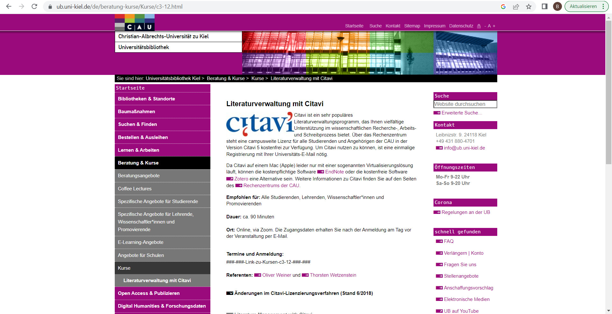

<!--
author:   Britta Petersen
email:    b.petersen@rz.uni-kiel.de
version:  1.0
language: de
narrator: deutsch female
title: Besuch aus dem Zentralen Forschungsdatenmanagement (FDM): FAIR-Prinzipien & Linked Open Data

comment: Beitrag zum Seminar [Philosophinnen im Exil: Digital Humanities II](http://www.univis.uni-kiel.de/form?__s=2&dsc=anew/lecture_view&lvs=philos/philos/zentr/philos&anonymous=1&founds=philos/philos/zentr/hesiod,/kierke,/medien,/naturu,/philos,/simone,techn/infor/inform/fachdi/imfbse&nosearch=1&ref=main&sem=2024s&__e=896) (Sommer 2024)

licence: cc-by

icon: https://github.com/RDM4CAU/Demos/raw/main/Frauenvortragsmarathon2024/images/cau-norm-en-lilagrey-rgb.png

@style

.lia-slide__container {
    background-image: url("https://github.com/RDM4CAU/Demos/raw/main/Frauenvortragsmarathon2024/images/rdmCAU.png");
    background-size: 15%;
    background-repeat: no-repeat;
    background-position: right top;
    opacity: 1;
}

@end

-->

# FDM, FAIR & LOD

> <big>**Besuch aus dem Zentralen Forschungsdatenmanagement (FDM):**</big> 
> <big>**FAIR-Prinzipien & Linked Open Data**</big> 
>
>***Sommersemester 2024***
>
> ***Britta Petersen***, [Zentrales Forschungsdatenmanagement](https://www.datamanagement.uni-kiel.de/de)

## Forschungsdatenmanagement?🗂️->💾

> Forschungsdatenmanagement (FDM) umfasst die Prozesse der **Transformation**, **Selektion** und **Speicherung** von Forschungsdaten mit dem gemeinsamen **Ziel**, diese *langfristig* und *personenunabhängig* **zugänglich**, **nachnutzbar** und **nachprüfbar** zu halten.
>
>(**forschungsdaten.info**)

{{1}}
********************************************************************************
Oder

- FDM beschäftigt sich mit Fragen zur Organisation, Erhebung, Dokumentation, Speicherung, Sicherung und den Zugriff auf Forschungsdaten.
- FDM hat zum Ziel, dass Daten korrekt und nachvollziehbar sind, um die Reproduzierbarkeit und die Nachnutzbarkeit von Forschungsergebnissen zu gewährleisten.
- FDM befasst sich sowohl mit Fragen zu technischer als auch zu formaler Zugänglichkeit von Forschungsdaten.
********************************************************************************

## Forschungsdaten?🧪

{{0-1}}
********************************************************************************

Was meinen wir eigentlich, wenn wir von ***Forschungsdaten*** sprechen? Welche Beispiele für ***Forschungsdaten*** können Sie nennen?
---
**Lassen Sie uns kurz gemeinsam sammeln!**

https://answergarden.ch/4138149

********************************************************************************

{{1-2}}
********************************************************************************
<iframe src="https://answergarden.ch/4138149" style="border:0px;width:100%;height:500px" allowfullscreen="true" webkitallowfullscreen="true" mozallowfullscreen="true"></iframe>

********************************************************************************

{{2}}
********************************************************************************
Die DFG schreibt hierzu:

> „Zu Forschungsdaten zählen u. a. Messdaten, Laborwerte, audiovisuelle Informationen, Texte, Surveydaten oder Beobachtungsdaten, methodische Testverfahren sowie Fragebögen. Korpora und Simulationen können ebenfalls zentrale Ergebnisse wissenschaftlicher Forschung darstellen und werden daher ebenfalls unter den Begriff Forschungsdaten gefasst. Da Forschungsdaten in einigen Fachbereichen auf der Analyse von Objekten basieren (z. B. Gewebe-, Material-, Gesteins-, Wasser- und Bodenproben, Prüfkörper, Installationen, Artefakte und Kunstgegenstände), muss der Umgang mit diesen ebenso sorgfältig sein und eine fachlich adäquate Nachnutzungsmöglichkeit, wann immer sinnvoll und möglich, mitgedacht werden. Ähnliches gilt, wenn Software für die Entstehung oder Verarbeitung von Forschungsdaten erforderlich ist.“
>
> [DFG: Checkliste zum Umgang mit Forschungsdaten, 2021](https://www.dfg.de/resource/blob/174732/3c6343eed2054edc0d184edff9786044/forschungsdaten-checkliste-de-data.pdf)

********************************************************************************

{{3}}
********************************************************************************

Für die Geisteswissenschaften definiert der ALLEA Report "Sustainable and FAIR data Sharing in the Humanities" den Begriff Forschungsdaten:

> “We could then define data in the humanities broadly as all materials and assets scholars collect, generate and use during all stages of the research cycle.”
>
> [Harrower, N.,Maryl, M., Biro, T.,Immenhauser, B., & ALLEA Working Group E-Humanities. (2020). Sustainable and FAIR Data Sharing in the Humanities: Recommendations of the ALLEA Working Group E-Humanities.](https://doi.org/10.7486/DRI.tq582c863)**

********************************************************************************

# Ziel: FAIRe Daten🎯

Um Daten langfristig und personenunabhängig zugänglich, nachnutzbar und nachprüfbar halten dienen die [FAIR-Prinzipien](https://www.nature.com/articles/sdata201618) als Leitprinzipien.
---

{{0-1}}
********************************************************************************
](https://univerlag.uni-goettingen.de/bitstream/handle/3/isbn-978-3-86395-539-7/Engelhardt_FAIR.pdf?sequence=1&).") <!-- width="550px" -->
********************************************************************************

{{1}}
>**F**indable

{{2-3}}
****************
Metadaten und Daten sollten sowohl für Menschen als auch für Computer leicht zu finden sein. Maschinenlesbare Metadaten sind für das automatische Auffinden von Datensätzen und Diensten unerlässlich und daher ein wesentlicher Bestandteil des FAIRification-Prozesses.

F1. (Meta)data are assigned a globally unique and persistent identifier

F2. Data are described with rich metadata (defined by R1 below)

F3. Metadata clearly and explicitly include the identifier of the data they describe

F4. (Meta)data are registered or indexed in a searchable resource

***************

{{1}}
>**A**ccessible

{{3-4}}
***********************
Es muss klar beschrieben sein, wie auf Daten zugegriffen werden kann, ggf. einschließlich Authentifizierung und Autorisierung.

A1. (Meta)data are retrievable by their identifier using a standardised communications protocol

A1.1 The protocol is open, free, and universally implementable

A1.2 The protocol allows for an authentication and authorisation procedure, where necessary

A2. Metadata are accessible, even when the data are no longer available

******************

{{1}}
>**I**nteroperable

{{4-5}}
**********************
Daten sollten in einer Form vorliegen, die die Nutzung mit diversen Anwendungen oder Arbeitsabläufen für Speicherung und Verarbeitung ermöglichen.

I1. (Meta)data use a formal, accessible, shared, and broadly applicable language for knowledge representation.

I2. (Meta)data use vocabularies that follow FAIR principles

I3. (Meta)data include qualified references to other (meta)data

**********************

{{1}}
>**R**eusable

{{5-6}}
***************
Das Ziel von FAIR ist es, die Wiederverwendung von Daten zu optimieren. Um dies zu erreichen, sollten Metadaten und Daten gut dokumentiert und beschrieben sowie mit einer eindeutigen Angabe bzgl. der Nutzungsbedingungen (z. B. Lizenzen) versehen sein.

R1. Meta(data) are richly described with a plurality of accurate and relevant attributes

R1.1. (Meta)data are released with a clear and accessible data usage license

R1.2. (Meta)data are associated with detailed provenance

R1.3. (Meta)data meet domain-relevant community standards

**************

# Linked Open Data (LOD)🔗

{{0-2}}
**********************
Tim Berners-Lee (2006) formulierte in seinem Aufsatz [Linked Data](https://www.w3.org/DesignIssues/LinkedData.html) vier "Regeln" bzgl. Linked Data:

1. Use URIs as names for things

2. Use HTTP URIs so that people can look up those names.

3. When someone looks up a URI, provide useful information, using the standards (RDF*, SPARQL)

4. Include links to other URIs. so that they can discover more things.

Tim Berners-Lee selbst schreibt zu diesen "Regeln":
"***I'll refer to the steps above as rules, but they are expectations of behavior.***"  

**********************

{{1-2}}
**********************
2010 erweiterte Tim Berners-Lee seinen Beitrag um das [**5-Sterne-Schema** für Linked Open Data](https://www.w3.org/DesignIssues/LinkedData.html):

|  |  |
| ★    | Available on the web (whatever format) but with an open licence, to be Open Data     |
| ★★    | Available as machine-readable structured data (e.g. excel instead of image scan of a table)     |
| ★★★    | as (2) plus non-proprietary format (e.g. CSV instead of excel)     |
| ★★★★    | All the above plus, Use open standards from W3C (RDF and SPARQL) to identify things, so that people can point at your stuff     |
| ★★★★★    | All the above, plus: Link your data to other people’s data to provide context     |

**********************

{{2-3}}
**********************
[Hasnain & Rebholz-Schuhman (2018)](https://link.springer.com/chapter/10.1007/978-3-319-98192-5_60) stellen im 5-Sterne-Schema dar, was Datennutzende mit LOD machen können:

|  |  |
| ★    | Achieving one star means that the user can be able to (1) access the data, (2) consume the data, (3) store it locally, (4) manipulate the data and 5 share the data. Whereas being publisher (1) it is easy and simple to publish the data.     |
| ★★    | Achieving two stars the user can be able to (1) process the data, (2) aggregate the data, (3) perform calculations, (4) visualise the data and can be exported into another (structured) format. Whereas being data publisher it is still simple to publish.     |
| ★★★    | Achieving three stars helps data user to do all what can be done using two stars Web data and additionally one can manipulate the data without any proprietary software package. Similarly as data publisher a converter may be needed to export the data from the proprietary format.     |
| ★★★★    | Achieving four stars helps data user to do all what can be done using three stars Web data and additionally (1) data can be linked using URI’s, (2) data can be partly accessed and (3) existing tools and libraries can be reused. On the other hand as data publisher (1) using RDF “Graph” of data can be more effort than tabular (Excel/CSV) or tree (XML/JSON) data, data can be combined safely with other data, (2) data can be merged and combined safely, (3) data can be presented using URIs which is a global scheme for representing data. Being publisher (1) one has fine-granular control over the data items and can optimise their access (load balancing, caching, etc.), (2) data can easily be sliced and diced, (3) URIs must be assigned to data.     |
| ★★★★★    | 	Achieving five stars helps data user to do all what can be done using four stars Web data and additionally (1) More data can be discovered while consuming the data, (2) data schema can directly be learned, (3) consumers have to deal with broken data links, and (4) One have to be cautious for linking new data with existing for trust and provenance related issues. On the other hand being data provider or publisher one (1) must have to make data discover-able, (2) can increase the value of the data, (3) can gain the same benefits from the links as the consumers, (4) need to invest resources to link data to existing data over the Web and (5) may face some overhead to repair broken or incorrect links.    |

**********************

{{2}}
**********************
>**Inwiefern gleichen bzw. unterscheiden sich die Prinzipien von Linked Open Data mit den FAIR-Prinzipien?**
**********************

# FAIR-Prinzipen vs. LOD Prinzipien

{{1-2}}
********************************************************************************
[Hasnain & Rebholz-Schuhman (2018)](https://link.springer.com/chapter/10.1007/978-3-319-98192-5_60) verglichen das 5-Sterne-Schema für LOD und die FAIR-Prizipien und stellen folgende Unterschiede heraus:

| LOD  | FAIR   |
| :--------- | :--------- |
| -> Hauptziel(e) der LOD-Grundsätze sind Erhöhung von Zugänglichkeit und Interoperabilität der Daten.      | -> Hauptziel der FAIR-Grundsätze ist eine Erhöhung der Nachnutzbarkeit von Daten.     |
| -> LOD schreibt offene Daten vor       | -> FAIR verlangt eine angegebene Lizenz, die nicht offen sein muss     |
| -> Metadaten gelten als interoperable Daten. Dokumentation und Kontextualisierung sind weniger stark gefordert.       | -> FAIR betont die Notwendigkeit von Metadaten, um die Nachnutzbarkeit von Daten zu verbessern.     |
| -> Ein Schlüsselelement der LOD-Grundsätze sind URIs.       | -> FAIR lässt ein breiteres Spektrum von Identifikatoren zu.     |
|       | -> FAIR benötigt eine unterstützte IT-Infrastruktur, die auch Restriktionen bzgl. der Zugänglichkeit zu Daten (z. B. Embargos, Einschränkungen via Lizenzen) ermöglichen muss, da Daten nicht notwendigerweise offen sind.     |
|       | ->  Die FAIR-Prinzien können auch auf Nicht-Daten angewendet werden (z. B. Codes, physische Proben, Workflows usw.).     |

********************************************************************************

{{2}}
********************************************************************************

**-> Beide, LOD und FAIR stellen einen Leitfaden/Orientierungshilfe für Datenproduzenten und -verleger dar.**

**-> Das LOD-Schema stellt einen Leitfaden für Datenanbieter und -verleger dar, der das ~~Ziel~~ verfolgt Daten ~~besser zugänglich~~ zu machen.**

**-> Die FAIR-Prinzipien hingegen legen einen stärkeren Fokus auf die Dokumentation und Kontextualisierung von Daten mit dem ~~Ziel~~ die ~~Nachnutzbarkeit~~ von Daten zu erhöhen.**

**-> Weder LOD noch die FAIR-Prinzipien schlagen einen bestimmten Standard, eine Technologie oder DIE eine Lösung vor.**

********************************************************************************
# FDM und GWP 🧚‍♀️

>Gutes Forschungsdatenmanagement und die Anwendung der FAIR-Prinzipien gelten als ein Teil **~~guter wissenschaftlicher Praxis~~ (GWP)**.
>
>Wie steht die CAU dazu? 
>
>Recherchieren Sie kurz nach den Leitlinien der CAU zur Guten Wissenschaftlichen Praxis und überfliegen Sie den Inhalt. Finden sich Bezüge zu den FAIR-Prinzipien?
>
>Verfügt die CAU auch über Leitlinien zu Open X?

{{1}}
********************************************************************************
>Was denken Sie? Inwiefern kann ein nachhaltiges Forschungsdatenmanagement und die Bearchtung der FAIR-Prinzipen zur Guten Wissenschaftlichen Praxis beitragen?
********************************************************************************

{{2}}
********************************************************************************
>**Gutes Forschungsdatenmanagement trägt bei zu...**
>
> - Reproduzierbarkeit von Ergebnissen (GWP)
> - Rückverfolgbarkeit und Transparenz der Forschung (GWP)
> - gute Auffindbarkeit von Daten, z. B. durch aussagekräftige Benennung und beschreibende Metadaten
> - Wissenserhalt – Daten sollen unabhängig von einzelnen Menschen, Projekten oder Institutionen zugänglich sein (GWP)
> - Erleichterung der Zusammenarbeit
> - Vorbeugung von Datenverlusten
> - Schonung von Resourcen
> - Transfer und Nachnutzung der Daten in zukünftigen Projekte
> - Erhöhung der Sichtbarkeit der eigenen Arbeit durch Forschungsdatenzitation
> - Erfüllung von Auflagen der Drittmittelgeber
> - ….

********************************************************************************

# Aktuelles 🆕

- **Forschungsförderer (DFG, BMBF, EU)** legen zunehmend Wert auf ein gutes Forschungsdatenmanagement und fordern z. B. den Nachweis entsprechender Planungen (DMPs) bei Einreichung von Forschungsanträgen.
- Aufbau einer [**Nationalen Forschungsdateninfrastruktur (NFDIs)**](https://www.nfdi.de/): Finanziert durch Bund und Länder entsteht derzeit ein bundesweit verteiltes Kompetenz- und Infrastrukturnetzwerk, das die Bereitstellung und Erschließung von Forschungsdaten für die Wissenschaft sicherstellen soll.
- Aufbau einer [**Landesinitiative zum Forschungsdatenmanagement in Schleswig-Holstein (FDM-SH)**](https://fdm-sh.de/de/)

# FDM@CAU ✨

  

Das **Zentrale Forschungsdatenmanagement** der CAU besteht aus Mitarbeitenden des Rechenzentrums, der Universitätsbibliothek und der Verwaltung.

Gemeinsam arbeiten, beraten und unterstützen wir zum Thema.

**Entwicklung eines campusweiten Forschungsdatenmanagements an der CAU**
2013	Zentrales FDM-Servicebüro und strategische Weiterentwicklung mit der AG FDM

2015	Verabschiedung einer universitären Leitlinie zum Umgang mit Forschungsdaten

2021	Zentrales FDM-Team 

**Zentrales Forschungsdatenmanagement heute**

- Derzeit 9 Kolleg*innen für FDM, DH, IT, Didaktik und Recht

- Kooperation zwischen RZ, UB, Verwaltung

- Entwicklung und Bereitstellung grundlegender Services für FAIR and Open Data

- Beratung und Schulungen für Forschende

- Praktische Unterstützung bei der Realisierung von FDM-Lösungen 

- Didaktische Beratung & Begleitung der Integration von FDM in die curriculare Lehre

- Einrichtung und Betrieb eines institutionelles Datenrepositoriums

Kontakte und Informationen zum FDM an der CAU finden Sie hier: https://www.fdm.uni-kiel.de/

## Literaturverwaltung 📚

{{0}}
***
Das Rechenzentrum stellt Ihnen eine Citavi-Campuslizenz zur Verfügung:

https://www.rz.uni-kiel.de/de/angebote/software/citavi/citavi

***

{{1}}
***
An der Universitätsbibliothek finden Sie Kurse zu citavi sowie verschiedenes Selbstlernmaterial:

https://www.ub.uni-kiel.de/de/beratung-kurse/Kurse/c3-12.html

***

## Opendata@CAU 🔓

<iframe src="https://opendata.uni-kiel.de/" style="border:0px;width:100%;height:500px" allowfullscreen="true" webkitallowfullscreen="true" mozallowfullscreen="true"></iframe>

## MACAU 📝

<iframe src="https://macau.uni-kiel.de/content/index.xml" style="border:0px;width:100%;height:500px" allowfullscreen="true" webkitallowfullscreen="true" mozallowfullscreen="true"></iframe>

## IGSN Dienst 🍃

<iframe src="https://igsn.uni-kiel.de/de" style="border:0px;width:100%;height:500px" allowfullscreen="true" webkitallowfullscreen="true" mozallowfullscreen="true"></iframe>

# Herzlichen Dank! 🎉
 <!-- width="250px" align="right" -->

 
 

Fragen oder Kommentare? 
---

# Informationen zu diesem Dokument

| Parameter | Kurzinformationen |
| -------- | :------ |
| Titel     |   @title   |
| Einsatz     |   @comment   |
| Autor:innen     |   @author   |
| Lizenz     |   @licence   |
| Link zum Repository     | https://github.com/RDM4CAU    |

Emijis used from [OpenMoji](https://emojipedia.org/openmoji)
Published with a Creative Commons (Attribution-ShareAlike 4.0 International) license.